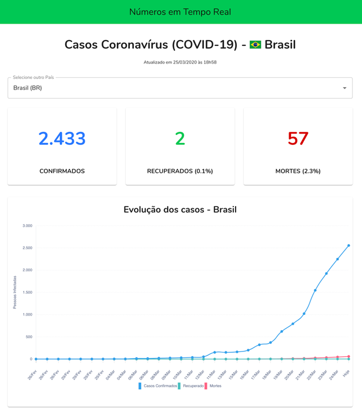

COVID-10 WebApp
===============

Acompanhe o número de casos do coronavírus (covid-19) com atualizações em tempo real.

https://covid19.adrianorosa.com

### Develop

    git clone git@github.com:adrianorsouza/covid-19.git
    cd covid-19
    npm start

# Deploy

    cd client 
    ./deploy.sh

## Author

**Adriano Rosa** [@adrianorosa](https://twitter.com/adrianorosa)  
https://adrianorosa.com

## Licence

Copyright © 2019, Adriano Rosa  <info@adrianorosa.com>
All rights reserved.

For the full copyright and license information, please view the LICENSE 
file that was distributed within the source root of this project. 

[screenshot]: ./screenshot.png
